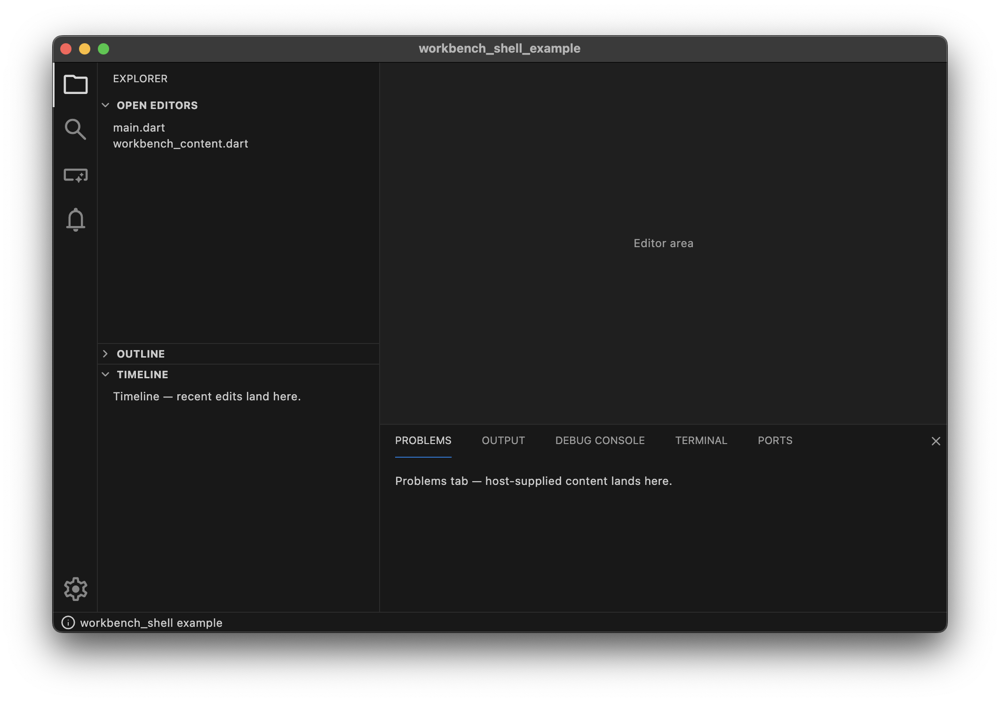

# workbench_shell

VS Code-style workbench layout chrome for Flutter desktop and mobile apps.
Provides the activity bar, sidebar, editor area, tabbed bottom panel,
status bar, and platform-conditional menu bar, plus a small vocabulary of
structural primitives (section, subsection, card, toggle card, empty
state) that keep sidebar and panel content visually consistent by
construction.



## Features

- `WorkbenchLayout` — composes activity bar + sidebar + editor + bottom
  panel + status bar, with controlled or uncontrolled section navigation.
- `WorkbenchTabbedPanel` — scrollable tab strip, close button, stable
  tab ids, View-menu and keyboard-shortcut focus contract.
- `WorkbenchStatusBar` + `WorkbenchStatusBarProblemsItem` — canonical
  VS Code Problems indicator with three severity counts.
- `WorkbenchMenuBar` — native `PlatformMenuBar` on macOS, in-window
  `MenuBar` on Windows and Linux.
- `WorkbenchShortcuts` — ships the Cmd/Ctrl+J bottom-panel toggle;
  hosts register additional shortcuts via `extraShortcuts` or a
  surrounding `Shortcuts` widget.
- `WorkbenchViewPane`, `WorkbenchSubsection`, `WorkbenchCard`,
  `WorkbenchToggleCard`, `WorkbenchEmptyState` — structural primitives
  that encode the workbench's visual hierarchy.
- `WorkbenchTheme` + `WorkbenchThemeController` — VS Code theme JSON
  loader, token map, and active theme state. Bundled themes: Dark/Light
  2026, Dark/Light Modern, Dark+/Light+ (Visual Studio), Monokai, and
  Solarized Dark/Light.
- `TokenTheme` — syntax-highlighting companion surface populated from
  `tokenColors`.
- `NotificationService`, `NotificationHost`, `NotificationProgressController`
  — stacked toast cards anchored bottom-right, with progress and
  auto-dismiss.
- `WorkbenchLayoutConstants` — fixed geometry (activity bar width,
  sidebar widths, status bar height, spacing scale, icon sizes).

## Install

```bash
flutter pub add workbench_shell
```

## Usage

```dart
import 'package:flutter/material.dart';
import 'package:workbench_shell/workbench_shell.dart';

void main() => runApp(const ExampleApp());

class ExampleApp extends StatelessWidget {
  const ExampleApp({super.key});

  @override
  Widget build(BuildContext context) {
    // Build a WorkbenchTheme from VS Code theme JSON. This resolves an
    // empty map to dark defaults; load a bundled palette (Dark Modern,
    // Monokai, …) at runtime via WorkbenchThemeController.
    final workbench = WorkbenchTheme.fromVscodeColorMap(
      const VscodeColorMap(name: 'Dark', baseType: 'vs-dark', colors: {}),
    );

    return MaterialApp(
      theme: ThemeData.dark().copyWith(extensions: [workbench]),
      home: Scaffold(
        body: WorkbenchLayout(
          activityBarItems: const [
            ActivityBarItem(id: 'explorer', label: 'Explorer', icon: Icons.folder),
            ActivityBarItem(id: 'search', label: 'Search', icon: Icons.search),
          ],
          // Each activity-bar item maps to a typed view container, not a
          // raw widget. mergeSingleView lets a lone view fill the sidebar
          // body (header hidden); pass two or more views for a collapsible
          // pane stack.
          containerBuilder: (containerId) => WorkbenchViewContainerSpec(
            mergeSingleView: true,
            views: [
              WorkbenchViewDescriptor(
                id: containerId,
                title: containerId,
                bodyBuilder: (context) => const SizedBox.shrink(),
              ),
            ],
          ),
          editor: const Center(child: Text('Editor')),
          bottomPanel: const SizedBox.shrink(),
          statusBar: const WorkbenchStatusBar(),
        ),
      ),
    );
  }
}
```

A runnable example with five sidebars, a tabbed bottom panel, a
notification demo, and a status bar lives under [`example/`](example/).

## API

Full API documentation is generated from source and published at
[pub.dev/documentation/workbench_shell](https://pub.dev/documentation/workbench_shell/latest/).

## Design

Chrome that is generic to a VS Code-style workbench belongs in
`workbench_shell`; chrome that encodes a specific product's domain
stays in the consuming application. The package imports only Flutter,
`equatable`, `material_color_utilities`, and `material_symbols_icons`;
it carries no BLoCs, domain types, or business logic.

See [SPEC.md](SPEC.md) for scope, boundary, theming contract, and
rationale.

## Host responsibilities

`workbench_shell` is chrome, not an application. It owns no storage, no
window, no domain state, and no content. Anything that outlives a single
layout or reaches the operating system belongs to the consuming app. For
each such concern the shell exposes a *controlled hook* — a value the host
supplies plus a callback the shell fires on change — so the host drives and
persists it. Omit the hook and the shell falls back to a sensible default,
for the current session only.

| Concern | The shell provides | The consuming app owns |
| --- | --- | --- |
| Sidebar width, panel height | `sidebarWidth`/`onSidebarWidthChanged`, `panelHeight`/`onPanelHeightChanged` | storing and restoring them across restarts |
| View-pane order, expansion, sizes | `order`/`onReorder`, `expanded`/`onExpandedChanged`, `sizes`/`onSizesChanged` | storing and restoring them across restarts |
| Active container, panel visibility | controlled props with change callbacks | the remembered selection |
| Window size and position | renders into the surface it is given | initial size, position, and persistence on every platform that is not fullscreen-only (desktop) |
| Persistent storage | nothing — no storage dependency | the mechanism (`shared_preferences`, `path_provider` + a file, a database) |
| Editor, sidebar bodies, panel tab content | builder slots | the widgets and their state |
| Domain and business logic | nothing | all of it |
| Theme choice | VS Code theme JSON loader + `WorkbenchThemeController` | which theme is active and when it switches |
| Commands and shortcuts beyond the built-ins | `ToggleBottomPanelIntent`, Cmd/Ctrl+J | extra intents, key bindings, menu items |

**Window management.** The shell never sizes, positions, or persists the
host window; it fills whatever surface Flutter hands it. On desktop,
restoring the window's last size and position is the host's job — for
example AppKit's `setFrameAutosaveName` on macOS, or the `window_manager`
package for cross-platform desktop. Mobile and web targets are full-surface,
so nothing is required there.

## License

BSD 3-Clause -- see [LICENSE](LICENSE).
